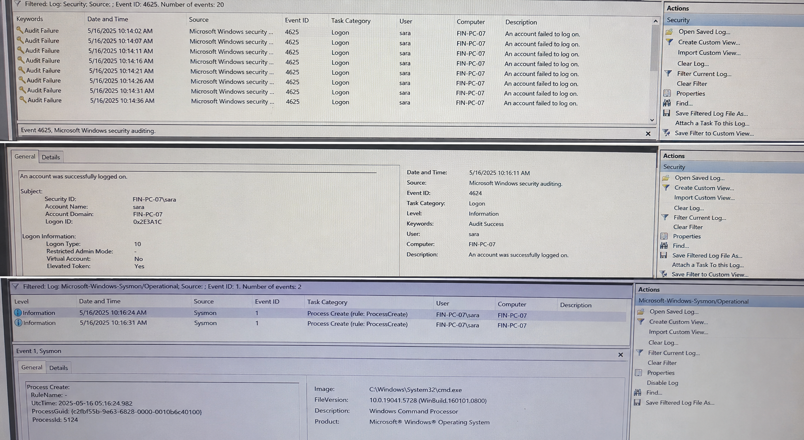

# Brute-Force Authentication Investigation

> **Lab Type:** Simulated SOC L1 Investigation
> **Category:** Authentication / Brute-Force Detection
> **Platform:** Windows Security Logs / SIEM-style telemetry

## 1. Objective

Investigate a sequence of **20 failed authentication attempts followed by a successful login** and determine whether the activity is consistent with a possible brute-force or password-guessing attack.

---

## 2. Scenario

The SOC received an alert for repeated authentication failures against the account `sara` on host `FIN-PC-07`.

The investigation identified:

* **20 failed authentication attempts**
* Target account: `sara`
* Source IP: `185.92.14.77`
* Logon Type: `10 (RemoteInteractive)`
* A successful authentication occurred after the failures
* Host reconnaissance commands were executed shortly after the successful login

---

## 3. Relevant Windows Event IDs

| Event ID | Description                                |
| -------- | ------------------------------------------ |
| 4625     | Failed logon                               |
| 4624     | Successful logon                           |
| 4672     | Special privileges assigned to a new logon |
| 4648     | Logon attempted using explicit credentials |
| 4740     | Account locked out                         |

Primary events used in this investigation:

* **4625 — Failed Logon**
* **4624 — Successful Logon**
* **Event ID 1 — Process Creation**

---

## 4. Timeline

| Time              |            Event | Account | Source IP    | Activity                       |
| ----------------- | ---------------: | ------- | ------------ | ------------------------------ |
| 10:14:02–10:15:36 |        4625 × 20 | sara    | 185.92.14.77 | Failed authentication attempts |
| 10:16:11          |             4624 | sara    | 185.92.14.77 | Successful authentication      |
| 10:16:24          | Process Creation | sara    | —            | `whoami` executed              |
| 10:16:31          | Process Creation | sara    | —            | `Get-Process` executed         |

---

## 5. Targeted Account

**Account:** `sara`

The same account was targeted during all 20 failed authentication attempts and the subsequent successful authentication.

---

## 6. Source IP

**Source IP:** `185.92.14.77`

The same source IP was associated with the failed authentication attempts and the successful login.

---

## 7. Logon Type

**Logon Type 10 — RemoteInteractive**

This indicates a remote interactive authentication session, commonly associated with remote access such as RDP.

The presence of repeated Type 10 failures makes the authentication activity particularly relevant for investigation.

---

## 8. Analysis

The authentication sequence shows a concentrated pattern:

```text
20 Failed Logons
      ↓
Same Account: sara
      ↓
Same Source IP: 185.92.14.77
      ↓
Logon Type 10
      ↓
Successful Logon
      ↓
whoami
      ↓
Get-Process
```

The `whoami` command identifies the security context under which the process is running.

`Get-Process` enumerates processes currently running on the host.

Neither command is inherently malicious. Both are legitimate administrative commands.

However, their execution immediately after a successful authentication increases the concern because they can also be used for host reconnaissance.

The combination of repeated failures, successful authentication from the same source, and subsequent reconnaissance is more suspicious than any individual event.

---

## 9. Indicators of Suspicious Activity

* 20 failed authentication attempts within a short period
* Same account targeted repeatedly
* Same source IP used for the attempts
* RemoteInteractive logon type
* Successful authentication after repeated failures
* Host reconnaissance immediately after authentication
* Same source IP associated with both failed and successful authentication

---

## 10. Assessment

### Verdict: Suspicious — Possible Successful Brute-Force / Password-Guessing Attack

The evidence is consistent with a possible successful password-guessing attack.

However, the available telemetry does **not** conclusively prove that an attacker performed the authentication attempts.

Alternative explanations include:

* The legitimate user repeatedly entered an incorrect password.
* A remote-access client was using stale credentials.
* The successful authentication was legitimate.
* The account credentials were obtained through another method.

Additional investigation is therefore required before declaring the account compromised.

---

## 11. Recommended Next Steps

### 1. Validate with the user

Confirm whether Sara initiated the successful remote login and whether she normally uses remote access.

### 2. Investigate post-authentication activity

Review activity after the successful login, including:

* Process creation
* PowerShell activity
* File creation
* Network connections
* Persistence mechanisms
* Privileged activity

### 3. Investigate the source IP

Search `185.92.14.77` across authentication telemetry to determine whether it:

* Targeted other accounts
* Accessed other hosts
* Generated additional failed logins
* Successfully authenticated elsewhere

### 4. Preserve evidence

Maintain the relevant authentication events and timeline for further investigation.

### 5. Escalate if compromise is confirmed

If Sara denies the login or additional malicious activity is identified, escalate the incident according to the organization's incident-response procedure.

---

## 12. Lessons Learned

* A high number of failed logins does not automatically prove brute force.
* A successful login after repeated failures significantly increases the risk.
* Correlating `4625` and `4624` events provides stronger evidence than examining either event independently.
* Logon Type provides important context about how authentication occurred.
* Legitimate commands such as `whoami` and `Get-Process` can become suspicious when their timing and surrounding activity indicate possible reconnaissance.
* SOC analysts should distinguish **suspicious behavior** from **confirmed compromise**.
* User validation and post-authentication activity are important when determining whether an account was actually compromised.
## Evidence


  
